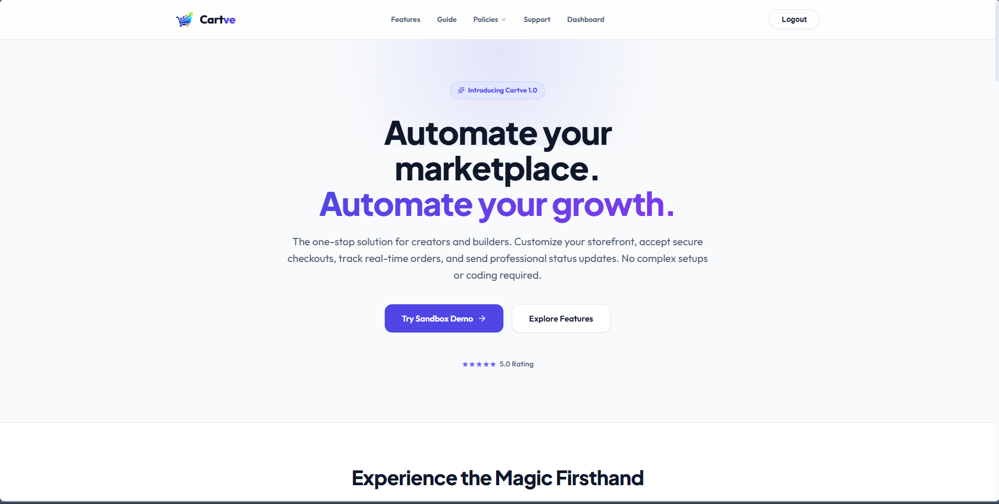
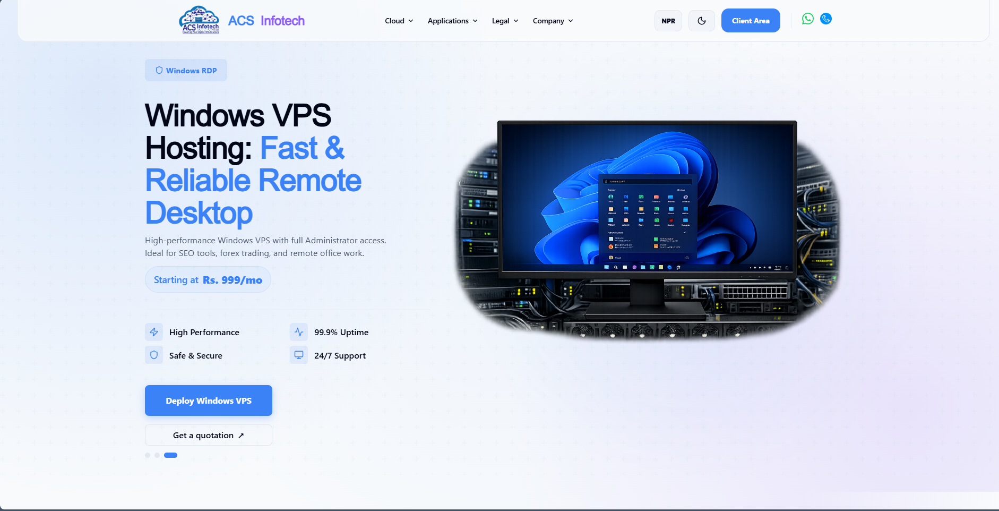
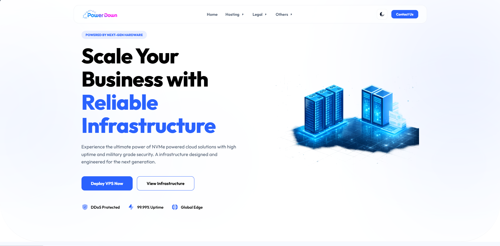

<div align="center">
  

  <br />
  <br />

  <h1>✨ Abhay P. | Expert Freelance Web Developer</h1>
  
  <p>
    <strong>High-Performance Websites • Cloud Infrastructure • E-Commerce Platforms</strong>
  </p>

  <p>
    <a href="https://abhayp.xyz/">View Live Portfolio</a>
  </p>

  <div>
    
    
    
    
  </div>
</div>

<br />

## ✦ About Me

I am a passionate **Freelance Web Developer** specializing in building fast, interactive sites for brands and individuals. From sleek landing pages to complex e-commerce platforms, I deliver high-quality code with an eye for modern, beautiful design. 

Honest scopes, quick delivery, and premium aesthetics.

---

## 🚀 Featured Projects

Here are some of the standout platforms I have built and scaled:

<details open>
<summary><b>🛒 Cartve - Startup E-commerce Platform</b></summary>
<br/>

<br/><br/>
A full-stack, scalable e-commerce solution designed for modern startups. Fast load times, seamless checkout experiences, and robust admin tools.
</details>

<br/>

<details open>
<summary><b>☁️ ACS Infotech - Cloud Hosting Nepal</b></summary>
<br/>

<br/><br/>
A reliable cloud hosting provider tailored for the Nepalese market. Built with performance and security at its core.
</details>

<br/>

<details open>
<summary><b>⚡ Power Down Hosting</b></summary>
<br/>

<br/><br/>
A premium hosting solution focused on maximizing uptime and raw performance for demanding applications.
</details>

---

## 🛠️ Quick Start

Want to run this portfolio locally? It's incredibly fast to get started.

### 1. Clone the repository
```bash
git clone https://github.com/yourusername/portfolio.git
cd portfolio
```

### 2. Install dependencies
```bash
npm install
```

### 3. Start the dev server
```bash
npm run dev
```

Visit `http://localhost:5173` to see it in action!

---

## 📬 Let's Connect

Looking for an expert developer to bring your vision to life? Let's talk!

- **Website:** [abhayp.xyz](https://abhayp.xyz/)
- **Email:** *add-your-email-here*
- **LinkedIn:** *[Your LinkedIn Profile](https://linkedin.com/in/yourprofile)*

<br/>

<div align="center">
  <p><sub>Built with ❤️ by Abhay P. using React & Vite.</sub></p>
</div>
